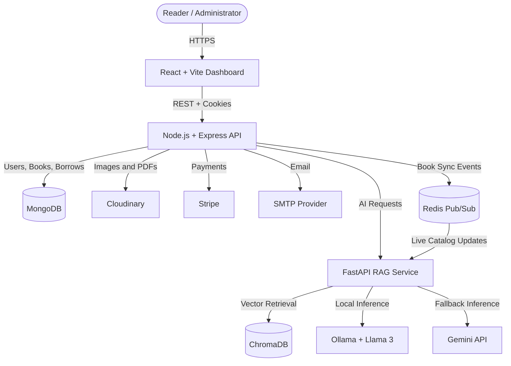
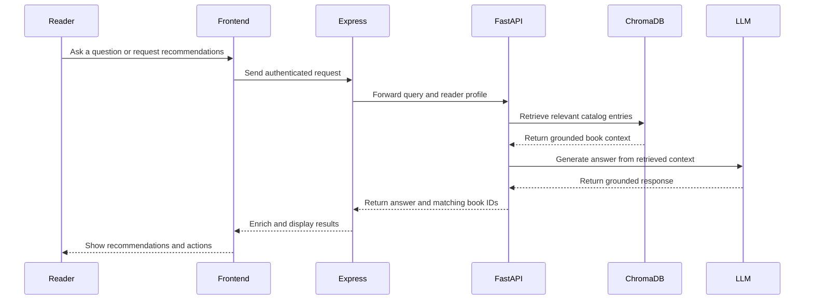

<div align="center">
  

  # Library Management System

  **A full-stack, AI-powered platform for managing books, readers, borrowing, payments, and personalized discovery.**

  [](https://react.dev/)
  [](https://nodejs.org/)
  [](https://fastapi.tiangolo.com/)
  [](https://www.mongodb.com/)
  [](https://www.docker.com/)
</div>

---

## Project Overview

### Problem Statement

Traditional library workflows often split catalog management, borrowing records, payments, reader preferences, and discovery across disconnected tools. This creates extra work for administrators and makes it harder for readers to find relevant books or understand their account status.

### Our Solution

This project brings the complete library experience into one platform:

1. **Centralized catalog management** — Admins can add, update, remove, issue, and return books from a single dashboard.
2. **Reader self-service** — Members can browse the catalog, request books, track borrowed titles, manage personal shelves, and access purchased e-books.
3. **AI-powered discovery** — Retrieval-Augmented Generation (RAG) grounds chat answers and recommendations in the library's own catalog.
4. **Automated operations** — Redis synchronizes catalog changes with the vector index, while scheduled jobs handle overdue reminders.
5. **Integrated payments** — Stripe supports rentals, purchases, and payment confirmation through secure webhooks.

---

## System Architecture

### High-Level Architecture



### AI Recommendation Pipeline



---

## Core Features

### AI Librarian and Semantic Discovery

- Catalog-grounded chat with strict anti-hallucination guardrails.
- Personalized recommendations based on favorite genres, reading history, and shelves.
- Semantic retrieval using `all-MiniLM-L6-v2` embeddings and ChromaDB.
- Ollama/Llama 3 local inference with a Gemini API fallback.
- AI-generated book descriptions from uploaded PDF content.
- Live vector-index updates through Redis Pub/Sub when catalog records change.

### Reader Experience

- Account registration, OTP verification, login, and password recovery.
- Searchable book catalog with availability and pricing information.
- Borrow requests, rentals, purchases, and personal borrowing history.
- Custom shelves for **Want to Read**, **Currently Reading**, and **Completed** books.
- Favorite-genre preferences for personalized recommendations.
- Online access to purchased or available digital books.
- Dashboard summaries for active, completed, and overdue books.

### Administration

- Live dashboard metrics for books, users, active borrows, and overdue items.
- Add books with cover images, PDFs, pricing, stock, and AI-assisted descriptions.
- Update or remove catalog entries.
- Approve or reject borrowing requests.
- Record checkouts and process returns.
- Register additional administrators and settle outstanding user dues.
- Automated overdue-email reminders and fine tracking.

### Payments and Notifications

- Stripe Payment Intents for book rentals and purchases.
- Stripe Checkout support for legacy purchase flows.
- Verified webhook processing before account or inventory updates.
- Purchase confirmation and account emails through Nodemailer.
- Scheduled overdue reminders every 30 minutes.

---

## Technology Stack

### AI and Data

- **Python 3.10+** and **FastAPI** for the RAG microservice.
- **LangChain** for retrieval and prompt orchestration.
- **ChromaDB** for persistent vector storage.
- **Sentence Transformers** using `all-MiniLM-L6-v2`.
- **Ollama / Llama 3** for local generation.
- **Gemini API** as the optional inference fallback.

### Frontend

- **React 18** with **Vite**.
- **Redux Toolkit** for application state.
- **React Router** for navigation.
- **Tailwind CSS** for responsive styling.
- **Chart.js**, **Lucide React**, and **React Icons** for dashboards and visuals.
- **Axios** for authenticated API communication.

### Backend and Infrastructure

- **Node.js 20** with **Express 5**.
- **MongoDB** and **Mongoose** for application data.
- **JWT** authentication with HTTP cookies.
- **Redis** for event-driven catalog synchronization.
- **Stripe** for payment processing.
- **Cloudinary** for book covers and PDF storage.
- **Nodemailer** and **node-cron** for scheduled notifications.
- **Docker Compose** for local service orchestration.

---

## API Overview

Most protected endpoints require the authentication cookie returned after login.

### Authentication

| Method | Endpoint | Description |
|---|---|---|
| `POST` | `/api/v1/auth/register` | Register a reader |
| `POST` | `/api/v1/auth/verify_otp` | Verify a new account |
| `POST` | `/api/v1/auth/login` | Log in and receive an auth cookie |
| `GET` | `/api/v1/auth/logout` | Log out |
| `GET` | `/api/v1/auth/me` | Get the current user |
| `POST` | `/api/v1/auth/password/forgot` | Request a reset email |
| `PUT` | `/api/v1/auth/password/reset/:token` | Reset a password |

### Books and Borrowing

| Method | Endpoint | Description |
|---|---|---|
| `GET` | `/api/v1/book/all` | Get the complete catalog |
| `POST` | `/api/v1/book/rag-search` | Run semantic catalog search |
| `POST` | `/api/v1/book/admin/add` | Add a book as an administrator |
| `PUT` | `/api/v1/book/update/:id` | Update a book |
| `DELETE` | `/api/v1/book/delete/:id` | Delete a book |
| `POST` | `/api/v1/request/send/:bookId` | Submit a borrow request |
| `GET` | `/api/v1/request/all` | Get borrow requests |
| `PUT` | `/api/v1/request/manage/:requestId` | Approve or reject a request |
| `GET` | `/api/v1/borrow/my-borrowed-books` | Get the reader's borrowed books |
| `PUT` | `/api/v1/borrow/return-borrowed-book/:bookId` | Process a return |

### AI and Bookshelves

| Method | Endpoint | Description |
|---|---|---|
| `POST` | `/api/ai/ask` | Ask the AI librarian |
| `POST` | `/api/user/recommendations` | Generate personalized recommendations |
| `POST` | `/api/user/shelf` | Add or move a book on a shelf |
| `PUT` | `/api/user/preferences` | Update favorite genres |
| `GET` | `/api/user/shelves` | Get populated personal shelves |

### Payments

| Method | Endpoint | Description |
|---|---|---|
| `POST` | `/api/payments/create-intent` | Create a Stripe Payment Intent |
| `POST` | `/api/v1/payment/create-checkout-session` | Create a Stripe Checkout session |
| `POST` | `/api/payments/webhook` | Receive Stripe webhook events |

---

## Quick Start

### Prerequisites

- [Node.js 20+](https://nodejs.org/)
- [Python 3.10+](https://www.python.org/)
- [MongoDB](https://www.mongodb.com/) or MongoDB Atlas
- [Redis](https://redis.io/)
- [Ollama](https://ollama.com/) with `llama3:latest`, or a Gemini API key
- Docker and Docker Compose for the containerized workflow

### 1. Clone the Repository

```bash
git clone https://github.com/sachinyadav1131/Library-Management.git
cd Library-Management
```

### 2. Configure the Backend

Create `Backend/config/config.env`:

```env
PORT=4000
FRONTEND_URL=http://localhost:5173

MONGO_URI=mongodb://127.0.0.1:27017/Library_Management
REDIS_URL=redis://127.0.0.1:6379
FASTAPI_URL=http://localhost:8000

JWT_SECRET_KEY=replace_with_a_long_random_secret
JWT_EXPIRE=7d
COOKIE_EXPIRE=7

CLOUDINARY_CLIENT_NAME=your_cloudinary_name
CLOUDINARY_CLIENT_API=your_cloudinary_api_key
CLOUDINARY_CLIENT_SECRET=your_cloudinary_api_secret

SMTP_HOST=your_smtp_host
SMTP_PORT=587
SMIP_SERVICE=your_mail_service
SMTP_MAIL=your_email
SMTP_PASSWORD=your_email_password

STRIPE_SECRET_KEY=your_stripe_secret_key
STRIPE_WEBHOOK_SECRET=your_stripe_webhook_secret

HUGGINGFACE_API_KEY=your_huggingface_token
GEMINI_API_KEY=your_gemini_api_key
```

> `GEMINI_API_KEY` is optional when local Ollama inference is available. Hugging Face credentials are used by the backend's AI description and embedding helpers.

### 3. Configure the Frontend

Create `Frontend/.env`:

```env
VITE_BACKEND_URL=http://localhost:4000
VITE_API_BASE=http://localhost:4000
```

### 4. Install Dependencies

```bash
cd Backend
npm install

cd ../Frontend
npm install

cd ../AI
python -m venv .venv
```

Activate the Python environment:

```bash
# Windows PowerShell
.\.venv\Scripts\Activate.ps1

# macOS/Linux
source .venv/bin/activate
```

Then install the AI dependencies:

```bash
pip install -r requirements.txt
```

### 5. Build the Vector Index

Make sure MongoDB contains book records, then run:

```bash
cd AI
python ingest.py
```

This creates or refreshes the local `AI/chroma_db` index from the MongoDB catalog.

### 6. Run the Services

Use three terminals:

```bash
# Terminal 1 — Backend
cd Backend
npm run dev
```

```bash
# Terminal 2 — Frontend
cd Frontend
npm run dev
```

```bash
# Terminal 3 — AI service
cd AI
python main.py
```

The application will be available at:

- Frontend: `http://localhost:5173`
- Backend API: `http://localhost:4000`
- FastAPI service: `http://localhost:8000`
- FastAPI docs: `http://localhost:8000/docs`

### Run with Docker Compose

After creating the environment files:

```bash
docker compose up --build
```

Docker Compose starts the frontend, backend, AI service, and Redis. MongoDB and external providers must still be reachable using the values configured for your environment. The current AI service calls Ollama at `localhost:11434`; when it runs in a container, configure host access in `AI/main.py` or provide the Gemini fallback credentials to that container.

---

## Project Structure

```text
Library-Management/
├── AI/                 # FastAPI, RAG pipeline, embeddings, and ChromaDB
├── Backend/            # Express API, MongoDB models, controllers, and jobs
├── Frontend/           # React dashboard and reader/admin interfaces
├── docker-compose.yml  # Multi-service development environment
└── README.md
```

---

## Security Notes

- Never commit `config.env`, `.env`, API keys, SMTP credentials, or Stripe secrets.
- Use a strong, randomly generated JWT secret in production.
- Register the correct public webhook URL in Stripe and verify its signing secret.
- Restrict CORS origins and secure authentication cookies before deployment.
- Keep uploaded PDFs and private book assets behind appropriate authorization rules.

---

## Contributing

Contributions are welcome:

1. Fork the repository.
2. Create a feature branch: `git checkout -b feature/your-feature`.
3. Commit your changes.
4. Push the branch and open a pull request.

---

<div align="center">
  Built for smarter library operations and more personal reading experiences.
</div>
